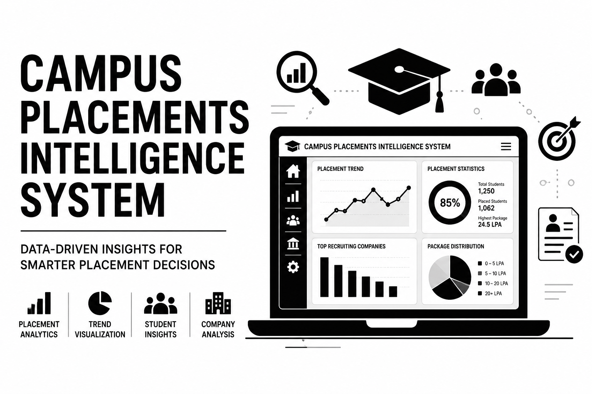

 

 

> **A full-stack campus recruitment management platform** that connects students, companies, and placement administrators with secure authentication, job management, eligibility checking, application tracking, and placement analytics.

 

**[🚀 Live Demo](https://campus-placements-intelligence-syst.vercel.app/)** · 
**[⚙️ Backend API](https://campus-placements-intelligence-system.onrender.com/)** ·
**[📚 Swagger Docs](https://campus-placements-intelligence-system.onrender.com/docs)**

---

# 📑 Table of Contents

- [Overview](#-overview)
- [Features](#-features)
- [Tech Stack](#-tech-stack)
- [Architecture](#-architecture)
- [Project Structure](#-project-structure)
- [Database Design](#-database-design)
- [Authentication](#-authentication)
- [API Modules](#-api-modules)
- [Results Gallery](#-results-gallery)
- [Setup & Usage](#-setup--usage)
- [Deployment](#-deployment)
- [Future Enhancements](#-future-enhancements)
- [Author](#-author)

---

# 🌍 Overview

## 🎓 Campus Placement Intelligence System

Campus Placement Intelligence System is a full-stack web application designed to automate and simplify campus recruitment workflows.

The platform provides separate environments for:

- 🎓 Students to manage profiles, resumes, and applications
- 🏢 Companies to create jobs and manage candidates
- 👨‍💼 Administrators to monitor placement activities

The system replaces traditional manual placement tracking with a centralized digital platform.

---

# ✨ Features

| Feature | Description |
|:---|:---|
| 🔐 Authentication | JWT-based secure login and registration |
| 👨‍🎓 Student Dashboard | Manage profile, skills, academics and applications |
| 🏢 Company Dashboard | Create jobs and manage applicants |
| 👨‍💼 Admin Panel | Manage students, companies and placement records |
| 📄 Resume Upload | Upload and manage student resumes |
| 🎯 Eligibility Checker | Automatically check student-company eligibility |
| 💼 Job Management | Create, update and track placement drives |
| 📝 Application Tracking | Students can apply and monitor status |
| 📊 Placement Analytics | Generate placement insights |
| 🔄 CRUD Operations | Complete backend data management |

---

# 🛠️ Tech Stack

| Category | Technology |
|:---|:---|
| Frontend | React.js + Vite |
| Backend | FastAPI |
| Language | Python |
| Database | PostgreSQL (Neon Cloud) |
| ORM | SQLAlchemy |
| Authentication | JWT + OAuth2 |
| Migration | Alembic |
| Deployment | Vercel + Render |
| Version Control | GitHub |

---

# 🏗️ Architecture

             Users
               |
               |
        React Frontend
          (Vercel)
               |
         REST API Calls
               |
               ▼
      FastAPI Backend
         (Render)
               |
               ▼
    PostgreSQL Database
         (Neon)

---

# 📁 Project Structure

campus-placements-intelligence-system/

│
├── frontend/
│ ├── src/
│ ├── pages/
│ ├── components/
│ └── package.json
│
├── alembic/
│ └── migrations/
│
├── main.py
├── database.py
├── model.py
├── schemes.py
├── requirements.txt
├── alembic.ini
└── README.md

---

# 🗄️ Database Design

Main Entities:

Users
|
├── Students
|
├── Companies
|
├── Jobs
|
└── Applications

Database Features:

- PostgreSQL relational database
- SQLAlchemy ORM models
- Alembic migration management
- Secure user relationships

---

# 🔐 Authentication Flow

User Login
|
▼
FastAPI Authentication API
|
▼
JWT Access Token
|
▼
Role Verification
|
▼
Student / Company / Admin Dashboard

Implemented using:

- JWT Tokens
- Password hashing
- Role-based authorization

---

# 📡 API Modules

| Module | Endpoints |
|:---|:---|
| Authentication | Login, Register, Token Refresh |
| Students | Profile CRUD, Student Management |
| Companies | Company CRUD |
| Jobs | Create & Manage Jobs |
| Applications | Apply Jobs & Status Tracking |
| Resume | Resume Upload |
| Analytics | Placement Analysis |
| Recommendations | Student Recommendations |

Swagger Documentation:

🔗 https://campus-placements-intelligence-system.onrender.com/docs

---
---

## 🖼️ Results Gallery

The application provides dedicated dashboards for students, companies, and administrators.

### 🔐 Authentication

#### Register & Login

---

## 👨‍🎓 Student Module

### 👩‍🎓 Student Dashboard & Profile Management

### 🏛️ Job Board & Applications

### 🤖 Recommendations & Eligibility

---

## 🛠️ Admin Module

### 👤 Admin Dashboard & User Management

---

## 🏢 Company Module

###🖱️Company Dashboard & Recruitment Management

### Application Tracking & Eligible Students

---
# ⚙️ Setup & Usage

## Backend Setup

Clone repository:

git clone https://github.com/jk-neha/campus-placements-intelligence-system.git

cd campus-placements-intelligence-system

## Install dependencies

pip install -r requirements.txt

## Create .env

DATABASE_URL=your_neon_database_url
SECRET_KEY=your_secret_key

## Run backend:

uvicorn main:app --reload

## Frontend Setup

## Navigate:

cd frontend

## Install packages:

npm install

## Create .env

VITE_API_URL=http://localhost:8000

## Run:

npm run dev

---

## ☁️ Deployment

GitHub Repository
        |
        |
        ├── Frontend
        |       |
        |       ▼
        |    Vercel
        |
        |
        └── Backend
                |
                ▼
              Render
                |
                ▼
              Neon DB

---

## 🔮 Future Enhancements

🤖 AI-based resume ranking
📧 Email notifications
📅 Interview scheduling system
📊 Advanced placement analytics
📱 Mobile application
🔎 Smart candidate recommendation engine

---

## 👩‍💻 Author

**Neha Vardhini J K** · [@jk-neha](https://github.com/jk-neha)  .[@linkedin](https://www.linkedin.com/in/nehavardhinijk/)

*Personal Project — Campus Placements Intelligence System*

---
*Until then ~~ become better*🌺
---

⭐ **Star this repo if you found it useful!**

